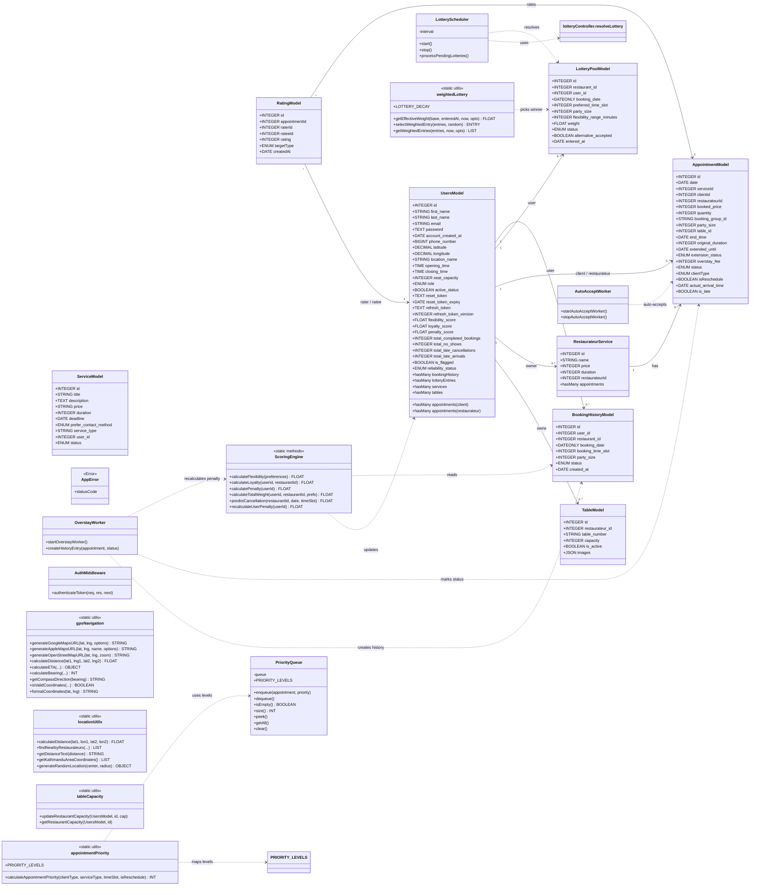

# RestroVibes — Class Diagram

Mermaid class diagram representing the system's domain models (Sequelize), business-logic classes (utils/services), background workers, and key middleware.

```mermaid
classDiagram
    direction LR

    %% ================= DOMAIN MODELS =================
    class UsersModel {
        +INTEGER id
        +STRING first_name
        +STRING last_name
        +STRING email
        +TEXT password
        +DATE account_created_at
        +BIGINT phone_number
        +DECIMAL latitude
        +DECIMAL longitude
        +STRING location_name
        +TIME opening_time
        +TIME closing_time
        +INTEGER seat_capacity
        +ENUM role
        +BOOLEAN active_status
        +TEXT reset_token
        +DATE reset_token_expiry
        +TEXT refresh_token
        +INTEGER refresh_token_version
        +FLOAT flexibility_score
        +FLOAT loyalty_score
        +FLOAT penalty_score
        +INTEGER total_completed_bookings
        +INTEGER total_no_shows
        +INTEGER total_late_cancellations
        +INTEGER total_late_arrivals
        +BOOLEAN is_flagged
        +ENUM reliability_status
        +hasMany bookingHistory
        +hasMany lotteryEntries
        +hasMany appointments (client)
        +hasMany appointments (restaurateur)
        +hasMany services
        +hasMany tables
    }

    class BookingHistoryModel {
        +INTEGER id
        +INTEGER user_id
        +INTEGER restaurant_id
        +DATEONLY booking_date
        +INTEGER booking_time_slot
        +INTEGER party_size
        +ENUM status
        +DATE created_at
    }

    class LotteryPoolModel {
        +INTEGER id
        +INTEGER restaurant_id
        +INTEGER user_id
        +DATEONLY booking_date
        +INTEGER preferred_time_slot
        +INTEGER party_size
        +INTEGER flexibility_range_minutes
        +FLOAT weight
        +ENUM status
        +BOOLEAN alternative_accepted
        +DATE entered_at
    }

    class AppointmentModel {
        +INTEGER id
        +DATE date
        +INTEGER serviceId
        +INTEGER clientId
        +INTEGER restaurateurId
        +INTEGER booked_price
        +INTEGER quantity
        +STRING booking_group_id
        +INTEGER party_size
        +INTEGER table_id
        +DATE end_time
        +INTEGER original_duration
        +DATE extended_until
        +ENUM extension_status
        +INTEGER overstay_fee
        +ENUM status
        +ENUM clientType
        +BOOLEAN isReschedule
        +DATE actual_arrival_time
        +BOOLEAN is_late
    }

    class RestaurateurService {
        +INTEGER id
        +STRING name
        +INTEGER price
        +INTEGER duration
        +INTEGER restaurateurId
        +hasMany appointments
    }

    class ServiceModel {
        +INTEGER id
        +STRING title
        +TEXT description
        +STRING price
        +INTEGER duration
        +DATE deadline
        +ENUM prefer_contact_method
        +STRING service_type
        +INTEGER user_id
        +ENUM status
    }

    class TableModel {
        +INTEGER id
        +INTEGER restaurateur_id
        +STRING table_number
        +INTEGER capacity
        +BOOLEAN is_active
        +JSON images
    }

    class RatingModel {
        +INTEGER id
        +INTEGER appointmentId
        +INTEGER raterId
        +INTEGER rateeId
        +INTEGER rating
        +ENUM targetType
        +DATE createdAt
    }

    %% ================= BUSINESS LOGIC =================
    class ScoringEngine {
        <<static methods>>
        +calculateFlexibility(preferences) FLOAT
        +calculateLoyalty(userId, restaurantId) FLOAT
        +calculatePenalty(userId) FLOAT
        +calculateTotalWeight(userId, restaurantId, prefs) FLOAT
        +predictCancellation(restaurantId, date, timeSlot) FLOAT
        +recalculateUserPenalty(userId) FLOAT
    }

    class LotteryScheduler {
        -interval
        +start()
        +stop()
        +processPendingLotteries()
    }

    class PriorityQueue {
        -queue
        +PRIORITY_LEVELS
        +enqueue(appointment, priority)
        +dequeue()
        +isEmpty() BOOLEAN
        +size() INT
        +peek()
        +getAll()
        +clear()
    }

    class AppError {
        <<Error>>
        +statusCode
    }

    %% ================= WORKERS =================
    class OverstayWorker {
        +startOverstayWorker()
        +createHistoryEntry(appointment, status)
    }

    class AutoAcceptWorker {
        +startAutoAcceptWorker()
        +stopAutoAcceptWorker()
    }

    %% ================= MIDDLEWARE / SUPPORT =================
    class AuthMiddleware {
        +authenticateToken(req, res, next)
    }

    class gpsNavigation {
        <<static utils>>
        +generateGoogleMapsURL(lat, lng, options) STRING
        +generateAppleMapsURL(lat, lng, name, options) STRING
        +generateOpenStreetMapURL(lat, lng, zoom) STRING
        +calculateDistance(lat1, lng1, lat2, lng2) FLOAT
        +calculateETA(...) OBJECT
        +calculateBearing(...) INT
        +getCompassDirection(bearing) STRING
        +isValidCoordinates(...) BOOLEAN
        +formatCoordinates(lat, lng) STRING
    }

    class locationUtils {
        <<static utils>>
        +calculateDistance(lat1, lon1, lat2, lon2) FLOAT
        +findNearbyRestaurateurs(...) LIST
        +getDistanceText(distance) STRING
        +getKathmanduAreaCoordinates() LIST
        +generateRandomLocation(center, radius) OBJECT
    }

    class weightedLottery {
        <<static utils>>
        +LOTTERY_DECAY
        +getEffectiveWeight(base, enteredAt, now, opts) FLOAT
        +selectWeightedEntry(entries, random) ENTRY
        +getWeightedEntries(entries, now, opts) LIST
    }

    class tableCapacity {
        <<static utils>>
        +updateRestaurantCapacity(UsersModel, id, cap)
        +getRestaurantCapacity(UsersModel, id)
    }

    class appointmentPriority {
        <<static utils>>
        +calculateAppointmentPriority(clientType, serviceType, timeSlot, isReschedule) INT
        +PRIORITY_LEVELS
    }

    %% ================= ASSOCIATIONS =================
    UsersModel "1" --> "0..*" BookingHistoryModel : user
    UsersModel "1" --> "0..*" LotteryPoolModel : user
    UsersModel "1" --> "0..*" AppointmentModel : client / restaurateur
    UsersModel "1" --> "0..*" RestaurateurService : owner
    UsersModel "1" --> "0..*" TableModel : owns
    RestaurateurService "1" --> "0..*" AppointmentModel : has
    RatingModel "*" --> "1" AppointmentModel : rates
    RatingModel "*" --> "1" UsersModel : rater / ratee

    %% ================= DEPENDENCIES =================
    LotteryScheduler ..> LotteryPoolModel : resolves
    LotteryScheduler ..> lotteryController.resolveLottery : uses
    ScoringEngine ..> BookingHistoryModel : reads
    ScoringEngine ..> UsersModel : updates
    OverstayWorker ..> ScoringEngine : recalculates penalty
    OverstayWorker ..> AppointmentModel : marks status
    OverstayWorker ..> BookingHistoryModel : creates history
    AutoAcceptWorker ..> AppointmentModel : auto-accepts
    weightedLottery ..> LotteryPoolModel : picks winner
    appointmentPriority ..> PriorityQueue : uses levels
    appointmentPriority ..> PRIORITY_LEVELS : maps levels
```
