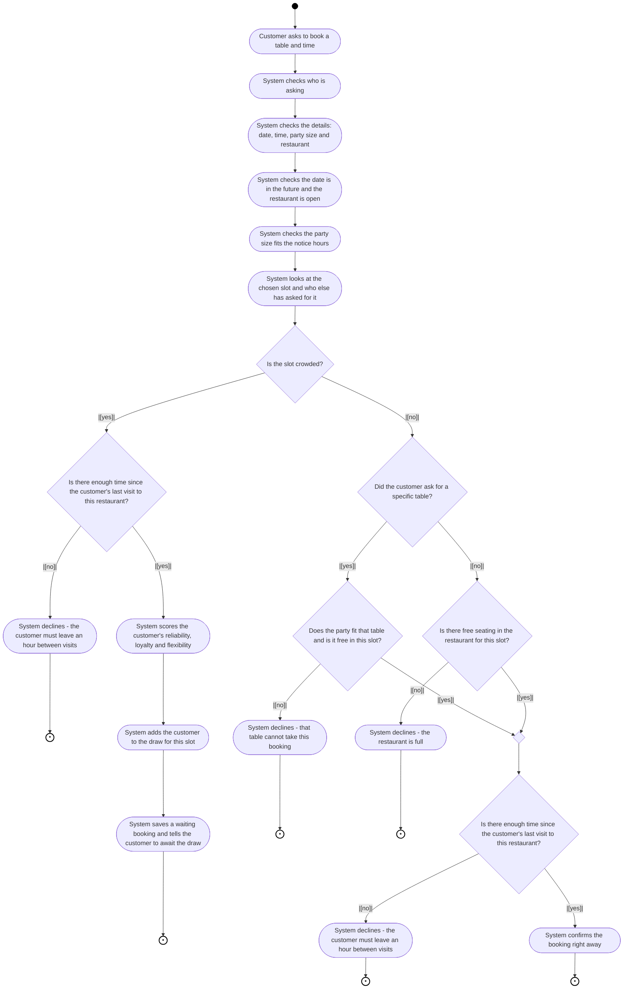
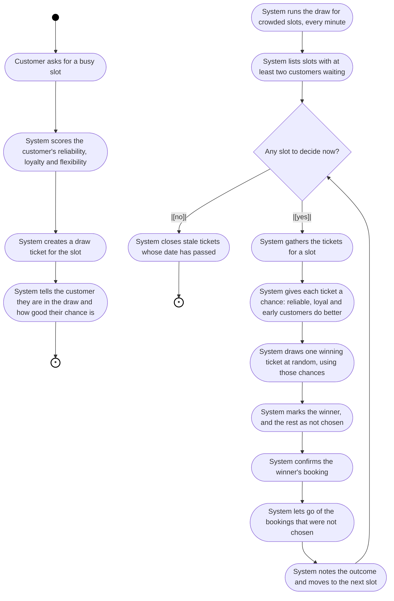
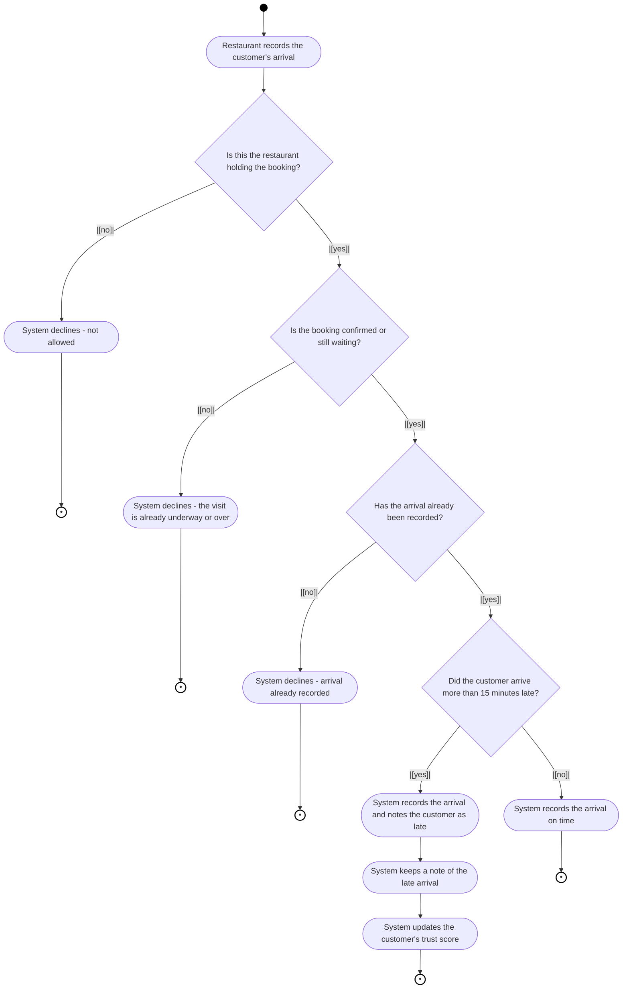
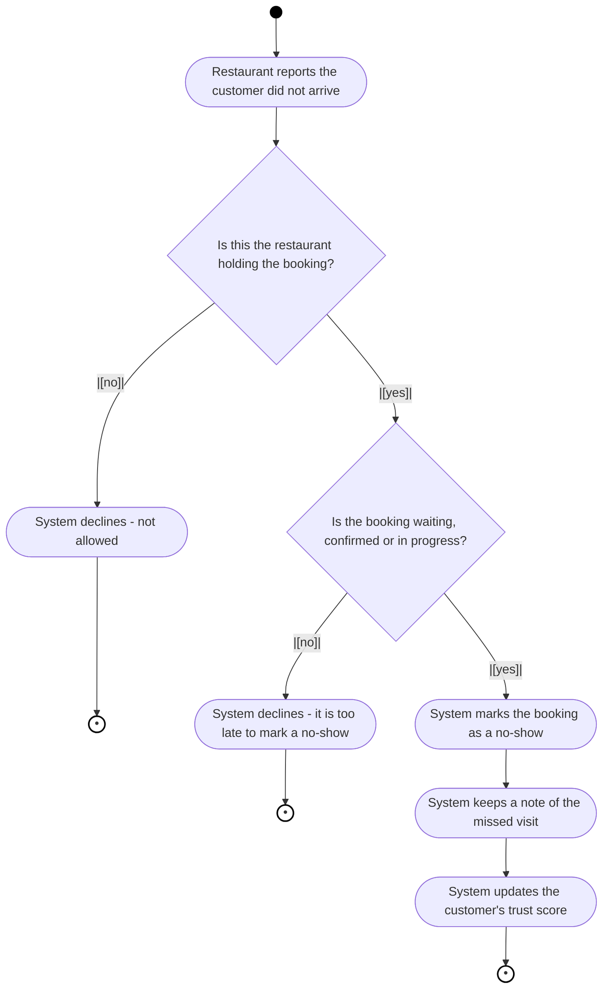
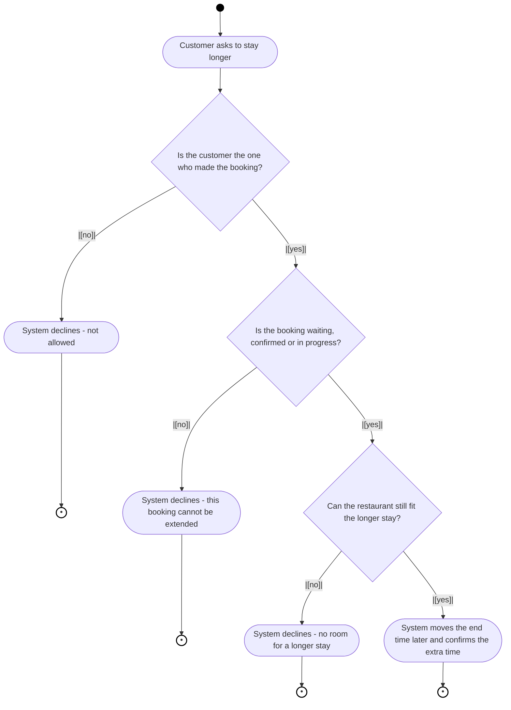
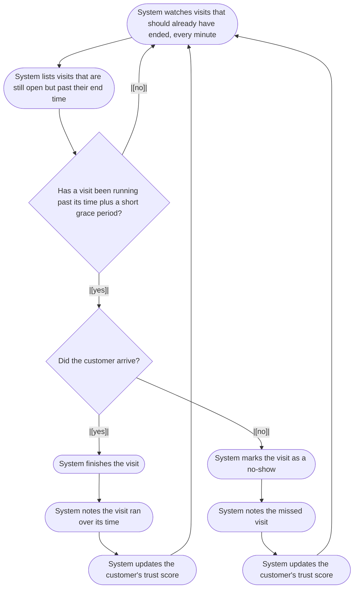
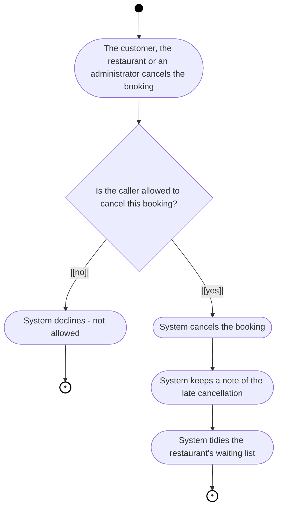
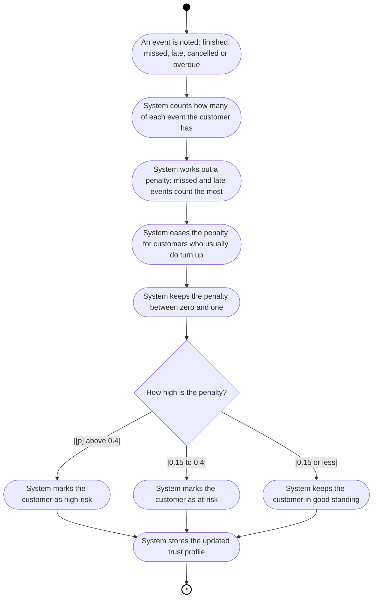
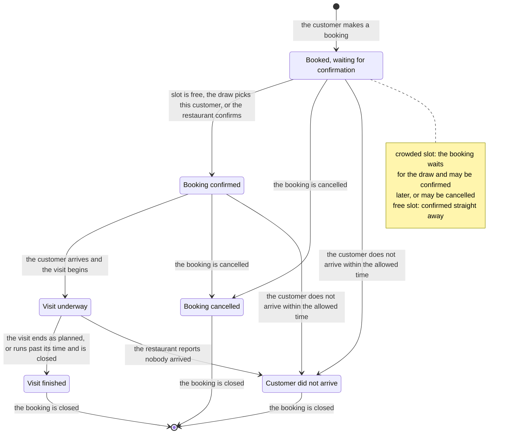
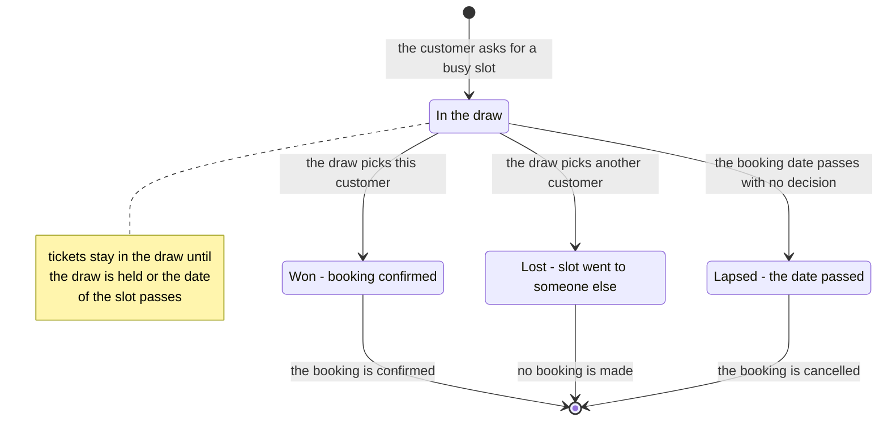

# RestroVibes — UML Process Model

Plain-language UML 2.5 activity and state-machine models of how the platform
works: booking a table, the draw for busy slots, what happens during and after a
visit, cancellations, and how the platform keeps a trust score for each
customer. The models describe *what happens*, not *how the code is written*.

## Notation Key

| UML node | Notation | Meaning |
|---|---|---|
| Initial node | filled circle | where a process begins |
| Activity | rounded rectangle | a step or action |
| Decision / merge | diamond | a fork in the road (with guards) or joining of two paths |
| Guard | `[condition]` on an arrow | the question that decides which path to take |
| Final node | circle-in-circle | end of a process |
| Loop | backward arrow | the process repeats |
| State | rounded rectangle (state machine) | where a booking currently stands |
| Transition | `what triggers it / what it does` | how a booking moves from one state to another |

The boxes also say who is acting: `Customer`, `Restaurant`, `System`.

---

## 1. UML Activity Diagram — Booking a Table

- A slot is *crowded* when another booking or draw request already covers it,
  so more than one customer is competing for the same table and time.
- When the slot is crowded, the system puts the customer into the draw
  automatically. When it is free, the booking is confirmed immediately.

---

## 2. UML Activity Diagram — The Draw for a Busy Slot

**What makes a customer's chance better**

| Factor | Effect |
|---|---|
| Everyone starts equal | base score of 100 |
| Flexible about time, date or party size | higher score (+up to 50) |
| Regular, loyal customer | higher score (+up to 30) |
| History of missed, late or cancelled visits | lower score (up to -200) |
| Asked earlier than others | small extra advantage |
| Lowest possible score | chance never falls below 1 |

---

## 3. UML Activity Diagram — During and After the Visit

### 3.1 The Customer Arrives

### 3.2 The Customer Does Not Arrive (No-Show)

### 3.3 The Customer Stays Longer

### 3.4 The Visit Runs Past Its Time

The system keeps watch in the background. It has no end point by design: each
check finishes, then the next one starts a minute later.

> A restaurant can also finish a visit by hand at any time. In addition, a
> background job confirms the single waiting booking for a free slot after a
> short wait, while crowded slots are always handed to the draw.

---

## 4. UML Activity Diagram — Cancelling a Booking

---

## 5. UML Activity Diagram — Keeping a Customer's Trust Score

Every visit that finishes, is missed, is late or is cancelled is noted. The
system turns those notes into a simple trust score for the customer.

| What happened | Cost to the trust score |
|---|---|
| Customer never arrived | 0.70 |
| Customer arrived late | 0.40 |
| Customer cancelled late | 0.30 |
| Customer overstayed | 0.15 |
| Customer usually shows up | the penalty is softened |

---

## 6. UML State Machine Diagram — What Happens to a Booking

This diagram shows the stages a booking moves through, and what moves it from
one stage to the next. It is written for non-technical readers, so everyday
words are used instead of internal names.

---

## 7. UML State Machine Diagram — A Customer's Ticket in the Draw

---

## 8. Process & Trigger Summary

| Process | When it happens | Outcome |
|---|---|---|
| Booking a table | The customer books a table and time | Confirmed, or waits for the draw |
| Joining the draw | The customer asks for a busy slot | A ticket is placed in the draw |
| Holding the draw | Automatically, every minute | One winner, everyone else released |
| Auto-confirming a free slot | Automatically, after a short wait | Waiting booking confirmed |
| Recording arrival | The restaurant notes the customer arrived | Visit starts; late arrivals are noted |
| Reporting a no-show | The restaurant reports the customer never arrived | Customer marked as a no-show |
| Extending a stay | The customer asks to stay longer | End time moved later |
| Closing late visits | Automatically, every minute | Overdue visits finished or marked as no-shows |
| Finishing a visit | The restaurant marks the visit as over | Visit finished |
| Cancelling | The customer, restaurant or admin cancels | Booking cancelled |
| Refreshing trust | After every finished, missed or cancelled visit | Customer's trust profile updated |