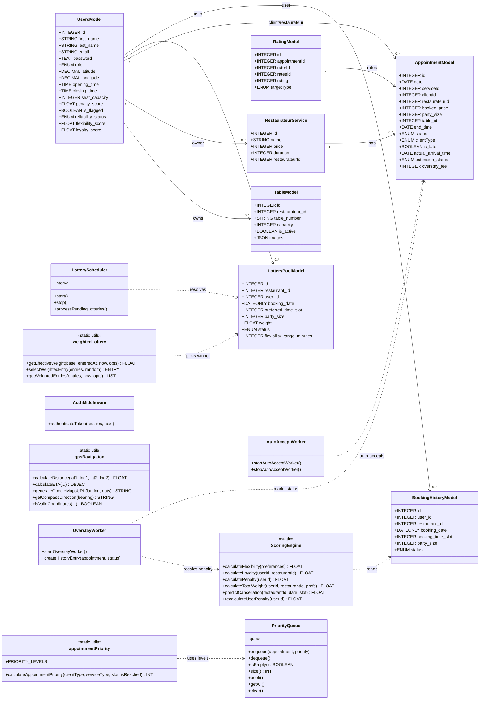
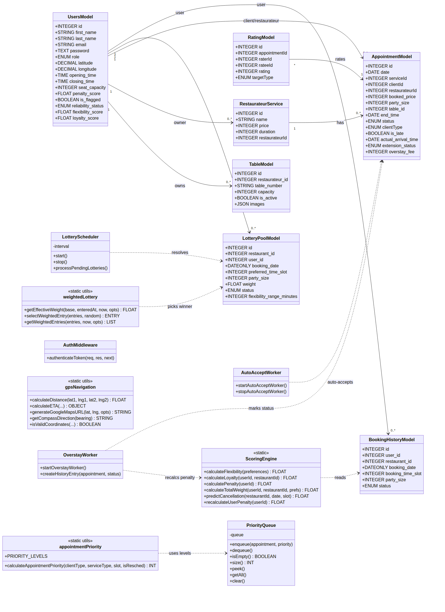
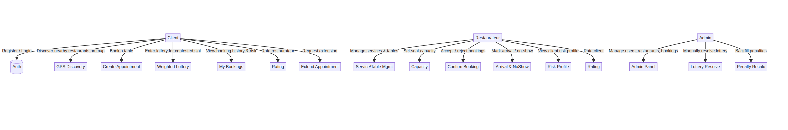
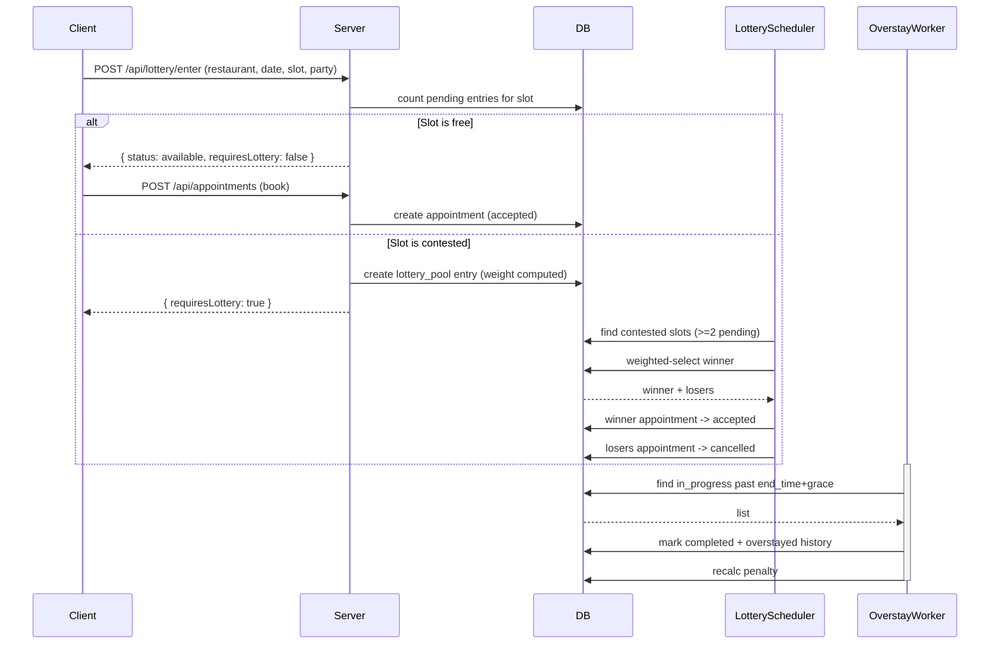
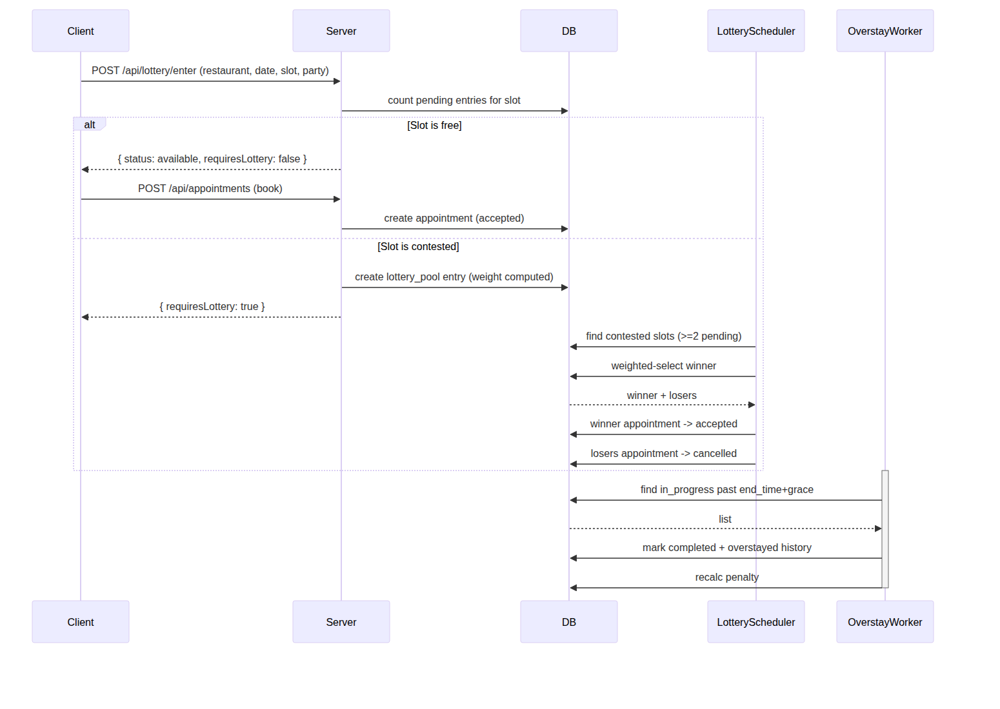

# RestroVibes — Project Report

## A Full-Stack Restaurant Booking & Slot-Lottery Platform

---

## Table of Contents

1. [Introduction & Problem Statement](#1-introduction--problem-statement)
2. [Objectives](#2-objectives)
3. [Scope & Users](#3-scope--users)
4. [Technology Stack](#4-technology-stack)
5. [System Architecture](#5-system-architecture)
6. [Database Design](#6-database-design)
7. [Core Features & Algorithms](#7-core-features--algorithms)
8. [Class Diagram](#8-class-diagram)
9. [Use-Case / Sequence Diagrams](#9-use-case--sequence-diagrams)
10. [API Design](#10-api-design)
11. [Background Workers](#11-background-workers)
12. [Deployment](#12-deployment)
13. [Testing & Limitations](#13-testing--limitations)
14. [Future Enhancements](#14-future-enhancements)
15. [Conclusion](#15-conclusion)

---

## 1. Introduction & Problem Statement

Restaurant no-shows and double-bookings cost the hospitality industry billions of dollars every year. When a guest fails to show up for a reserved table, the restaurant loses the revenue of an entire seat for the whole slot, with little time to rebook it. Similarly, when multiple guests request the same time slot at a busy restaurant, the restaurateur is forced to decide who gets the table manually, often without enough information about which guest is most reliable or most likely to actually show up.

**RestroVibes** is a full-stack restaurant appointment booking platform that directly addresses these problems. It connects **clients** with **restaurateurs** through an intelligent booking engine that:

- Enforces **real-time seat/table capacity** to prevent overbooking.
- Assigns every client a **reliability (penalty) score** based on their booking history, so restaurateurs can see — at a glance — how likely a guest is to honour a reservation.
- Resolves conflicting slot requests **fairly using a weighted lottery**, instead of a first-come-first-served race.
- Automates the **appointment lifecycle** (auto-accept, overstay detection, no-show marking) so the restaurateur does not have to manually track every booking.
- Enables **GPS-based discovery** of nearby restaurants with live occupancy and estimated travel time.

 *Logo asset located at `client/src/assets/Logo.png`.*

---

## 2. Objectives

1. **Prevent no-shows and overbooking** through capacity enforcement and automated life-cycle management.
2. **Quantify client reliability** with a transparent, weight-based penalty scoring engine.
3. **Resolve slot conflicts fairly** with a weighted lottery that rewards flexible, loyal, and reliable clients.
4. **Provide real-time visibility** for restaurateurs (competing bookings, client risk, live occupancy).
5. **Simplify discovery** with GPS-based nearby-restaurant search and turn-by-turn navigation links.
6. **Support three roles** — Client, Restaurateur, and Admin — with appropriate permissions.

---

## 3. Scope & Users

The system is a **three-role** platform:

| Role | Capabilities |
|---|---|
| **Client** | Register/login, discover nearby restaurants on a map, book tables (or enter a lottery for contested slots), view own booking history, rate restaurateurs, request extensions, manage profile & location |
| **Restaurateur** | Manage services & tables, set seat capacity, accept/reject/complete appointments, mark arrivals & no-shows, view per-client risk profiles, see competing bookings with priority queue |
| **Admin** | Oversee all users, restaurants, bookings, services, tables, and ratings; resolve lottery slots manually if needed |

Out of scope: real payment processing (booking price is recorded but not charged in this version), advanced route-optimisation (replaced by direct Haversine+map links).

---

## 4. Technology Stack

### Frontend (React SPA)
| Technology | Version | Purpose |
|---|---|---|
| React | 19.0 | Component-based UI |
| Vite | 6.3 | Build tool & dev server (ESM, fast HMR) |
| React Router DOM | 7.5 | Client-side routing |
| Axios | 1.9 | HTTP client with JWT refresh interceptors |
| Bootstrap / React-Bootstrap | 5.3 / 2.10 | UI component library |
| Tailwind CSS | 3.4 | Utility-first styling |
| Leaflet / React-Leaflet | 1.9 / 5.0 | Interactive map (OpenStreetMap tiles) |
| React Datepicker, React Icons, Lucide | — | Date picker & icons |
| JWT Decode | 4.0 | Client-side token parsing |

### Backend (Node.js Express)
| Technology | Version | Purpose |
|---|---|---|
| Node.js / Express | 18 / 5.1 | HTTP server & routing |
| Sequelize | 6.37 | SQL ORM |
| PostgreSQL (pg) | 14 / 8.14 | Relational database |
| bcrypt | 5.1 | Password hashing |
| JSON Web Token | 9.0 | Stateless auth (access + refresh) |
| Nodemailer | 9.0 | Email (password reset, confirmations) |
| Multer | 2.2 | File uploads (table images) |
| dotenv | 16.5 | Environment config |

### DevOps
- Docker & Docker Compose (PostgreSQL + server + client containers)
- Nginx (serves built client, proxies `/api` to the backend)
- Nodemon (dev auto-restart), ESLint (code quality)

---

## 5. System Architecture

The system follows an **MVC (Model–View–Controller)** architecture on the backend with a **React SPA** frontend communicating over a REST API.

```
┌─────────────────────────────────────────────────────────────┐
│                    CLIENT (React SPA)                        │
│   Login / SignUp                                            │
│   ┌───────────┐ ┌──────────────┐ ┌───────────────────┐       │
│   │ Client    │ │ Restaurateur │ │ Admin Panel       │       │
│   │ Portal    │ │ Dashboard    │ │                   │       │
│   └─────┬─────┘ └──────┬───────┘ └─────────┬─────────┘       │
│         │              │                   │                 │
│   ┌─────┴──────────────┴───────────────────┴───────────────┐  │
│   │           Axios API layer (JWT interceptors)           │  │
│   └────────────────────────┬───────────────────────────────┘  │
└────────────────────────────┼─────────────────────────────────┘
                             │ HTTP / REST (JSON)
┌────────────────────────────┼─────────────────────────────────┐
│                   SERVER (Express)                            │
│   ┌────────────────────────┴───────────────────────────────┐  │
│   │      Middleware chain (CORS, JSON, Auth JWT, errors)   │  │
│   └────────────────────────┬───────────────────────────────┘  │
│   Routes → Controllers → Models (Sequelize ORM)               │
│   ┌─────────────┐ ┌──────────────┐ ┌──────────────┐          │
│   │ AutoAccept  │ │ Overstay     │ │ Lottery      │          │
│   │ Worker      │ │ Worker       │ │ Scheduler    │          │
│   │ (2 min)     │ │ (60 sec)     │ │ (60 sec)     │          │
│   └─────────────┘ └──────────────┘ └──────────────┘          │
└────────────────────────────┬─────────────────────────────────┘
                             │ Sequelize / SQL
┌────────────────────────────┴─────────────────────────────────┐
│                   PostgreSQL Database                          │
│   Users, Appointments, RestaurateurServices, Tables,           │
│   Ratings, BookingHistory, LotteryPool                         │
└────────────────────────────────────────────────────────────────┘
```

### Design Patterns
| Pattern | Usage |
|---|---|
| **MVC** | Routes → Controllers → Models → DB |
| **Middleware Chain** | Auth & validation middleware before route handlers |
| **Repository** | Models encapsulate all DB access; controllers hold business logic |
| **Observer / Worker** | Background workers independently monitor & mutate appointment state |
| **Singleton** | `LotteryScheduler`, DB connection, shared `PriorityQueue` per restaurateur |

---

## 6. Database Design

### Entity–Relationship Overview

```
UsersModel (Client or Restaurateur)
   │  1                                    1
   │ hasMany                               hasMany
   ▼                                      ▼
BookingHistory ────► (user_id, restaurant_id) ◄──── Appointment ──► RestaurateurService
LotteryPool ───────► user_id                     │   ▲
   │                                          │   │ hasMany appointments
   │                                          ▼   │
   └────────────► (client / restaurateur)  Table ←┤
Rating ─────────► (rater / ratee)               │
```

### Tables & Key Attributes

#### UsersModel (`Users`)
| Attribute | Type | Notes |
|---|---|---|
| id | INTEGER PK | auto-increment |
| first_name / last_name | STRING | |
| email | STRING UNIQUE | login credential |
| password | TEXT | bcrypt hashed |
| role | ENUM | `client` / `restaurateurs` / `admin` |
| latitude / longitude | DECIMAL(10,6) | GPS for discovery |
| opening_time / closing_time | TIME | restaurant hours (restaurateur) |
| seat_capacity | INTEGER | max concurrent seats |
| penalty_score | FLOAT | computed reliability (0–1) |
| total_* counters | INTEGER | no-shows, late arrivals, late cancellations, completed |
| is_flagged | BOOLEAN | true when penalty > 0.4 |
| reliability_status | ENUM | `reliable` / `at_risk` / `flagged` |
| flexibility_score / loyalty_score | FLOAT | lottery inputs |
| refresh_token / refresh_token_version | TEXT / INT | token invalidation |

#### AppointmentModel (`AppointmentModels`)
- `id`, `date`, `serviceId`, `clientId`, `restaurateurId`
- `booked_price`, `quantity`, `booking_group_id` (multi-item bookings grouped)
- `party_size`, `table_id`
- `end_time`, `original_duration`, `extended_until`, `extension_status`, `overstay_fee`
- `status` ENUM: `pending / accepted / rejected / cancelled / in_progress / completed / no_show`
- `clientType` ENUM: `regular / vip / premium / emergency / walk_in`
- `isReschedule`, `actual_arrival_time`, `is_late`

#### Other Models
- **RestaurateurService**: `name`, `price`, `duration`, `restaurateurId`
- **ServiceModel** (legacy): `title`, `price`, `duration`, `service_type`, `user_id`, `deadline`, `status`
- **TableModel** (`tables`): `restaurateur_id`, `table_number`, `capacity`, `is_active`, `images` (JSON)
- **RatingModel** (`ratings`): `appointmentId`, `raterId`, `rateeId`, `rating (1–5)`, `targetType` (client/restaurateur); unique per appointment+rater+target
- **BookingHistoryModel** (`booking_history`): `user_id`, `restaurant_id`, `booking_date`, `booking_time_slot`, `party_size`, `status` (`completed / late_cancelled / no_show / upcoming / overstayed / late_arrival`)
- **LotteryPoolModel** (`lottery_pool`): `restaurant_id`, `user_id`, `booking_date`, `preferred_time_slot`, `party_size`, `flexibility_range_minutes`, `weight`, `status` (`pending / won / lost / expired`)

### Key Constraints
- Ratings unique on `(appointmentId, raterId, targetType)`.
- `booking_time_slot` and `preferred_time_slot` validated 0–95 (15-minute slots over 24h).
- Availability & capacity constraints enforced at the transaction level (SERIALIZABLE) to prevent race conditions.

---

## 7. Core Features & Algorithms

### 7.1 Client Reliability (Penalty) Scoring
Each behaviour has a **weight** reflecting its cost to the restaurant:

| Behaviour | Weight |
|---|---|
| No-show | 0.7 |
| Late arrival | 0.4 |
| Late cancellation | 0.3 |
| Overstay | 0.15 |

```
rawPenalty     = (noShows×0.7 + lateArrivals×0.4 + lateCancels×0.3 + overstays×0.15) / totalBookings
completionRatio= completed / totalBookings
decay          = min(completionRatio×0.15, rawPenalty×0.3)
penaltyScore   = max(0, rawPenalty − decay)
```

| Penalty | Reliability Status | Indicator |
|---|---|---|
| 0 – 0.15 | `reliable` | Green |
| 0.15 – 0.4 | `at_risk` | Yellow |
| > 0.4 | `flagged` | Red |

The decay mechanism rewards completed bookings but caps forgiveness so bad history is never fully erased.

### 7.2 Weighted Lottery
When multiple clients want the same contested slot, each enters a lottery with a weight:

```
BASE_WEIGHT = 100
totalWeight = BASE + (flexibility×50) + (loyalty×30) − (penalty×200)
```

- **Flexibility** (0–1): based on flexibility range (<30m→0.4, <60m→0.7, >60m→1.0) + alternative-date bonus.
- **Loyalty** (0–1): restaurant-specific completions + platform-wide completions + account age.
- **Effective weight** also includes an **ageing boost** (half-life 6h, max ×3) so earlier entries gain a slight edge.
- Winner's appointment → `accepted`; losers → `cancelled`.

### 7.3 Seat / Table Capacity Enforcement
- Restaurateur sets `seat_capacity` (1–1000).
- Booking fails if `party_size + active occupancy > seat_capacity`.
- Overstay worker releases seats when appointments expire.
- Table-specific capacity validated against the assigned `TableModel`.

### 7.4 GPS-Based Discovery
- Haversine great-circle distance: `d = R · 2·atan2(√a, √(1−a))` with R = 6,371 km.
- ETA estimated at 30 km/h (configurable) => `timeMinutes = (distance/speed)·60`.
- Live occupancy = `activeSeats / seat_capacity` shown on the map.
- External routing APIs (Google/Mapbox/OpenRouteService) were evaluated and rejected due to cost/access, so direct navigation links are generated instead.

### 7.5 Priority Queue
Appointments are prioritised by client type + urgency:

| Level | Priority |
|---|---|
| EMERGENCY | 100 |
| VIP | 80 |
| PREMIUM | 60 |
| REGULAR | 40 |
| WALK_IN | 20 |

Adjustments: `+10` for premium service, `+15` for reschedule, `+20` for bookings within the next 2 hours.

---

## 8. Class Diagram



*Rendered diagram: `docs/class-diagram.svg` (PNG: `docs/class-diagram.png`)*



---

## 9. Use-Case / Sequence Diagrams

### 9.1 Use-Case Diagram

```mermaid
flowchart TD
    C[Client] -->|Register / Login| A[(Auth)]
    C -->|Discover nearby restaurants on map| D[GPS Discovery]
    C -->|Book a table| B[Create Appointment]
    C -->|Enter lottery for contested slot| L[Weighted Lottery]
    C -->|View booking history & risk| H[My Bookings]
    C -->|Rate restaurateur| R[Rating]
    C -->|Request extension| E[Extend Appointment]

    R2[Restaurateur] -->|Manage services & tables| S[Service/Table Mgmt]
    R2 -->|Set seat capacity| CAP[Capacity]
    R2 -->|Accept / reject bookings| AC[Confirm Booking]
    R2 -->|Mark arrival / no-show| MS[Arrival & NoShow]
    R2 -->|View client risk profile| RP[Risk Profile]
    R2 -->|Rate client| RR[Rating]

    AD[Admin] -->|Manage users, restaurants, bookings| M[Admin Panel]
    AD -->|Manually resolve lottery| MR[Lottery Resolve]
    AD -->|Backfill penalties| BP[Penalty Recalc]
```



*Rendered diagram: `docs/use-case-diagram.svg` (PNG: `docs/use-case-diagram.png`)*



### 9.2 Booking + Lottery Sequence



*Rendered diagram: `docs/sequence-diagram.svg` (PNG: `docs/sequence-diagram.png`)*



---

## 10. API Design

All endpoints under `/api`. Authentication via `Authorization: Bearer <access_token>`.

### Authentication (`/api/auth`)
| Method | Path | Purpose |
|---|---|---|
| POST | /register | Create account, return tokens |
| POST | /login | Login |
| POST | /refresh-token | Rotate access+refresh tokens |
| POST | /logout | Invalidate refresh token |
| POST | /forgot-password | Send reset email |
| POST | /reset-password | Set new password |

### Appointments (`/api/appointments`)
| Method | Path | Purpose |
|---|---|---|
| POST | / | Create appointment (or enter lottery) |
| GET | /restaurateurs/:id | Restaurateur's appointments + risk data |
| GET | /client/:clientId | Client's bookings (grouped) |
| GET | /client/:clientId/risk-profile | Client reliability data |
| GET | /check-availability | Slot availability |
| PUT | /:id/confirm | Accept booking |
| PUT | /:id/cancel | Cancel booking |
| PUT | /:id/complete | Mark completed |
| PUT | /:id/no-show | Mark no-show (penalty) |
| PUT | /:id/arrived | Record arrival (late detection) |
| POST | /:id/extend | Extend appointment |
| GET | /priority | Priority-ordered queue (restaurateur) |

### Other resources
- **Users** `/api/users` — CRUD, capacity get/set.
- **Services** `/api/restaurateurs-services` and `/api/services` — manage offerings.
- **Tables** `/api/tables` — CRUD + dynamic capacity.
- **Location** `/api/location` — nearby discovery, update location, distance.
- **Ratings** `/api/ratings` — submit & query ratings.
- **Lottery** `/api/lottery` — enter, status, alternatives, resolve, scoring details.
- **Uploads** `/api/uploads` — table images (Multer).

**Response format:** `{ message, data }` on success, `{ message/error }` on failure.

---

## 11. Background Workers

| Worker | Interval | Grace | Action |
|---|---|---|---|
| **Auto-Accept** | 2 min | 20 min | Auto-accepts stale standalone pending bookings (1 per slot); leaves contested slots for manual/lottery handling |
| **Overstay** | 60 s | 10 min | `in_progress` past end+grace → `completed` + `overstayed` history; stale pending/accepted → `no_show`; recalculates penalty |
| **Lottery Scheduler** | 60 s | — | Resolves slots with ≥2 pending entries; expires stale entries |

These workers make the booking lifecycle self-maintaining and relieve the restaurateur from manually tracking every slot.

---

## 12. Deployment

### Docker Compose (`docker-compose.yml`)
| Service | Image | Exposed Port | Purpose |
|---|---|---|---|
| `postgres` | postgres:14-alpine | 5433:5432 | Database (health-checked) |
| `server` | Node 18 (Dockerfile) | 5000 | Express API |
| `client` | Node 18 build → nginx | 5173:80 | SPA static hosting |

The client Dockerfile uses a **multi-stage build**: build the React app with Vite then serve the `dist` output through Nginx (SPA fallback config included). The server runs `npm start` and performs a runtime schema auto-migration on startup (adds missing columns and Postgres enum values without data loss).

### Environment Variables
| Variable | Purpose |
|---|---|
| DB_NAME / DB_USER / DB_PASSWORD / DB_HOST / DB_PORT | Database connection |
| PORT | Server port |
| JWT_SECRET / JWT_REFRESH_SECRET | Token signing |
| EMAIL_* / EMAIL_MODE | Nodemailer (dev prints to console) |
| OVERSTAY_GRACE_MINUTES / OVERSTAY_FEE_PER_MINUTE | Overstay policy |
| VITE_API_URL / VITE_MAP_TILE_URL | Client config |

### Auth / Token Life-cycle
- Access token: 1-hour JWT.
- Refresh token: 7-day JWT, versioned (`refresh_token_version`) so logout and refresh rotation invalidate old tokens.
- Axios interceptor transparently refreshes on 401 and retries the original request.

---

## 13. Testing & Limitations

### Manual / Validation Testing
- Phone validation: `/^(98|97)\d{8}$/` (Nepal format).
- Booking rules: 1-hour minimum gap between same-restaurant bookings; booking within opening/closing hours; party size + occupancy ≤ capacity.
- Rating bounds 1–5; unique per appointment/direction.
- Password: min 8 chars, bcrypt-hashed.

### Known Limitations
1. **Legacy naming**: Some identifiers retain barber-domain names (`barbarId`, `BarberServices`, legacy tables in `utils/jwt.js`) — the domain was partially renamed from a barber to a restaurant system.
2. **Broken handler**: `getSlottedDynamicPricing` references undefined `SLOT_DEFINITIONS`/`buildSlotDate` and would throw at runtime.
3. **No real payments**: prices are recorded but not charged.
4. **GSM-free routing**: distances are great-circle (straight-line), not road-based.
5. **Mixed migration strategy**: several migration stubs are empty; schema largely relies on model definitions + runtime auto-migration.

---

## 14. Future Enhancements

- Integrate real payment gateway (e.g., eSewa, Khalti, Stripe).
- Replace Haversine with real routing APIs (Google/Mapbox) for accurate ETA.
- Add push notifications & SMS reminders to further reduce no-shows.
- Implement restaurant-facing analytics dashboards (occupancy trends, revenue).
- Add multi-branch support and franchise-level management.
- Clean up legacy naming and consolidate the migration strategy.

---

## 15. Conclusion

RestroVibes delivers a complete, production-shaped restaurant booking platform with the three pillars — **reliability scoring**, **capacity enforcement**, and **fair weighted-lottery conflict resolution** — that together reduce no-shows, prevent overbooking, and give restaurateurs clear, data-driven insight into every reservation. The modular MVC backend, self-maintaining background workers, and a polished three-role React frontend make it a robust and extensible solution for modern restaurant appointment management.

---

*Prepared as project documentation for defense.*
