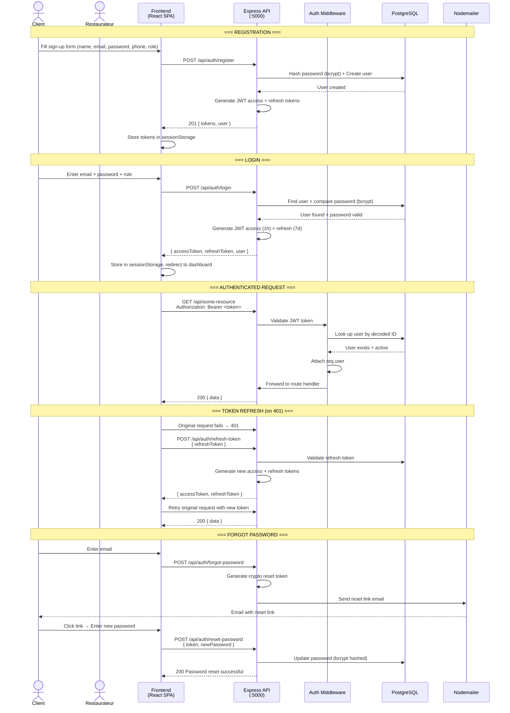
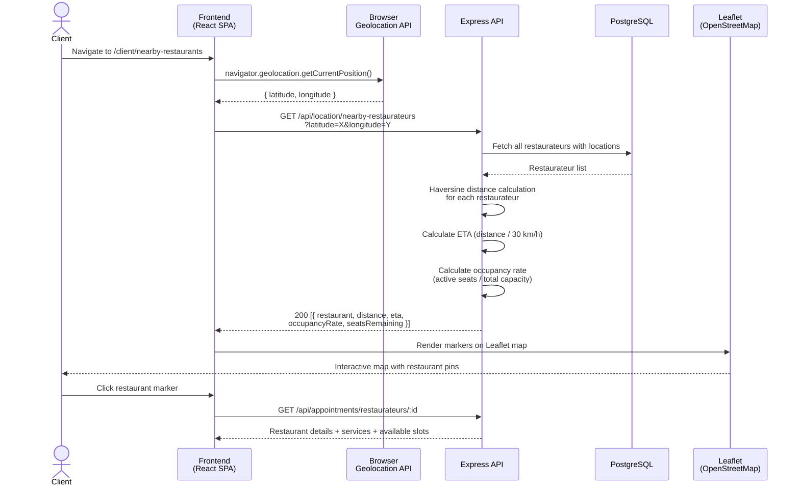
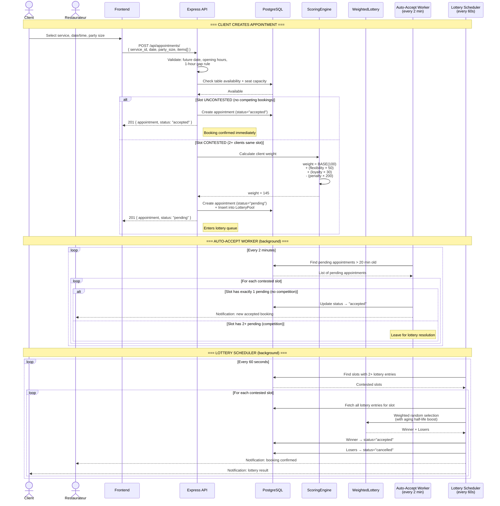
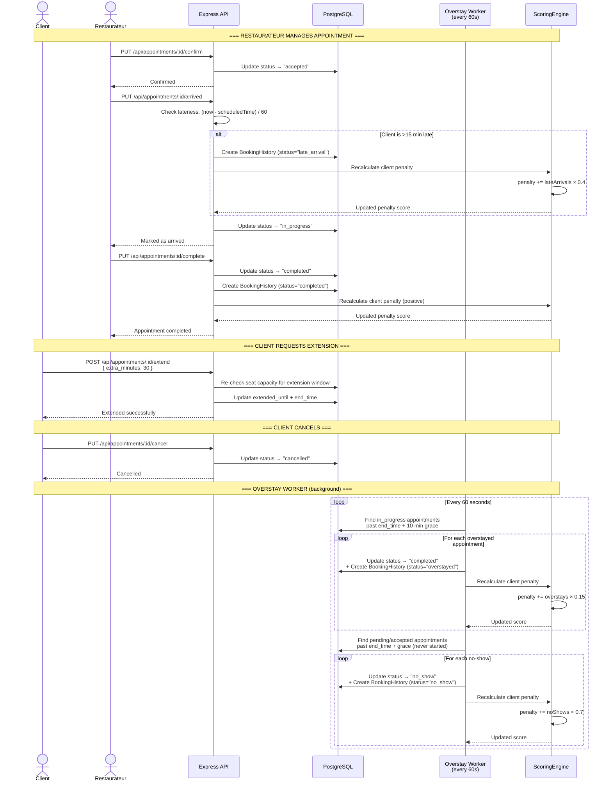
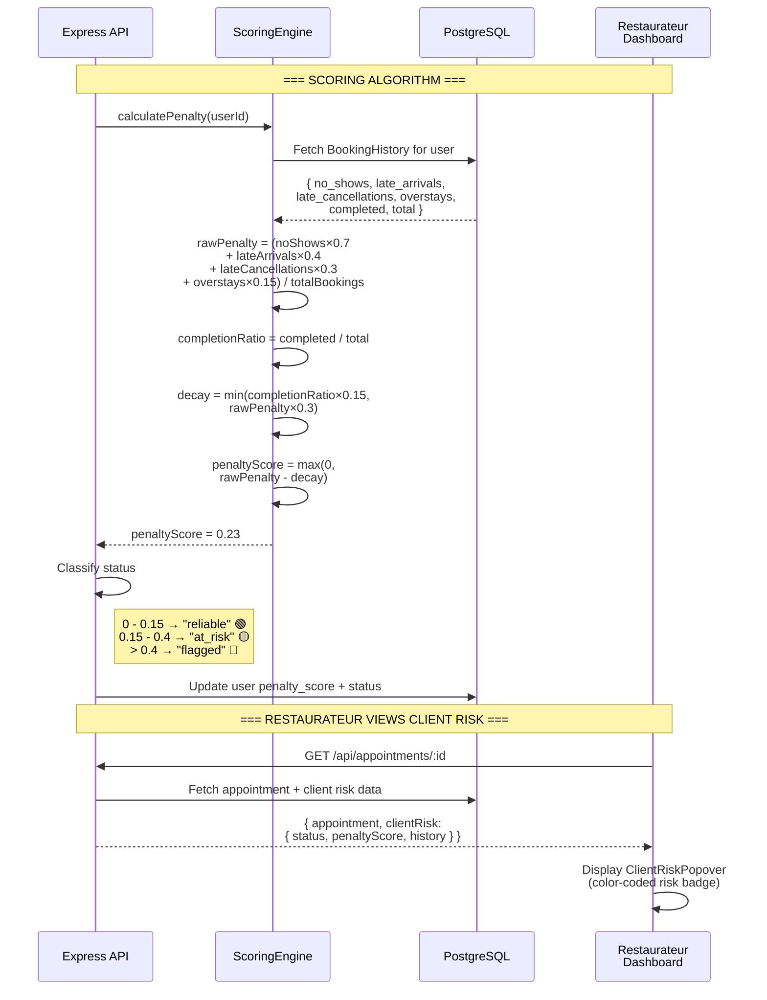
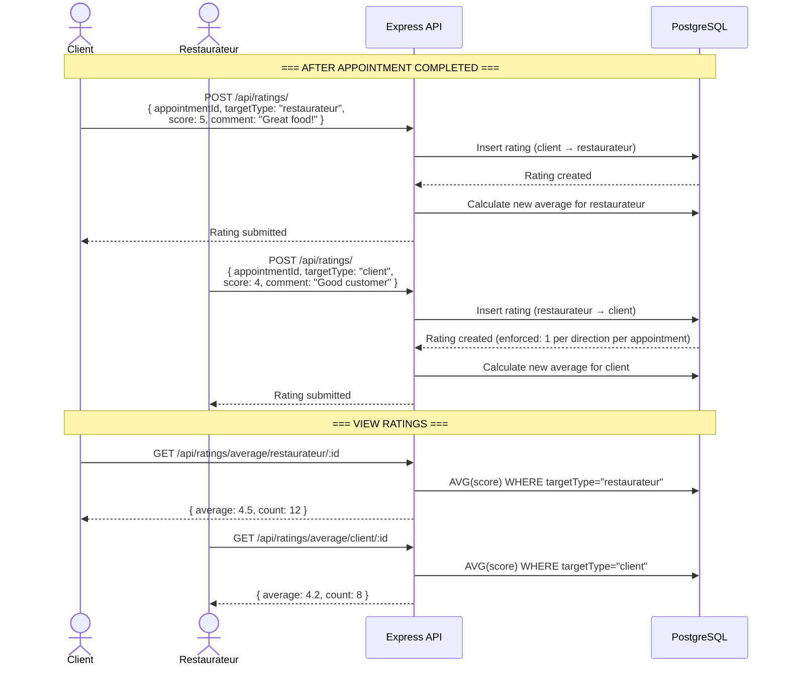

# RestroVibes - System Sequence Diagrams

## 1. Authentication Flow



---

## 2. Restaurant Discovery (GPS-Based)



---

## 3. Booking Flow (With Lottery System)



---

## 4. Appointment Lifecycle (Full State Machine)



---

## 5. Client Reliability Scoring



---

## 6. Bidirectional Rating System



---

## System Architecture Overview

```
┌─────────────────────────────────────────────────────────┐
│                    Docker Compose                         │
│  ┌──────────────┐  ┌──────────────┐  ┌──────────────┐  │
│  │   Client      │  │   Server     │  │   Database   │  │
│  │   (Vite:5173) │──│  (Express    │──│  (PostgreSQL │  │
│  │   React SPA   │  │   :5000)     │  │   :5433)     │  │
│  └──────────────┘  └──────────────┘  └──────────────┘  │
│         │                │                    │          │
│   Bootstrap 5       JWT Auth           Sequelize ORM     │
│   Tailwind CSS      Middleware         Migrations        │
│   Leaflet Map       Background Workers                   │
│   Axios + Interceptors  ┌─────────────┐                 │
│                         │  Workers:    │                 │
│                         │  • Overstay  │                 │
│                         │  • AutoAccpt │                 │
│                         │  • Lottery   │                 │
│                         └─────────────┘                 │
└─────────────────────────────────────────────────────────┘
```
